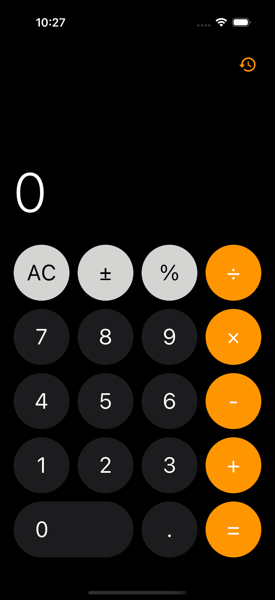
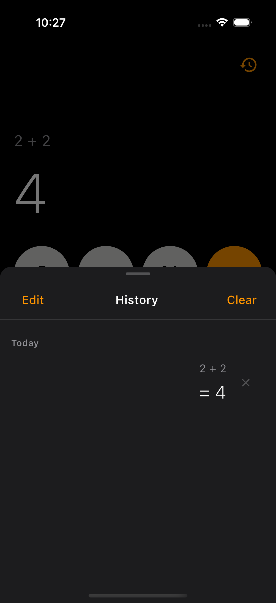

# 🧮 Calculator App

A sleek, modern calculator built with **Flutter**, featuring a polished dark UI, full calculation history with persistence, and smooth horizontal scrolling for long expressions and results.

---

## 📱 App Screens

<p align="center">
  
  
</p>

---

## 🚀 Features

* ➕ ➖ ✖️ ➗ Full arithmetic operations
* 📜 Calculation history with grouped timestamps (Today / Yesterday / Date)
* 🔁 Load any past result back into the calculator
* ↔️ Horizontally scrollable display for long numbers and expressions
* 🔢 Live expression line — shows `2 + 2` as you type the second number
* ✏️ Edit mode — select and delete multiple history entries
* 🗑️ Swipe-to-delete individual history items
* 🔗 Operator chaining — `3 + 4 ×` evaluates intermediate result first
* 🔒 Blocks repeated `=` press — must add a new operator to continue
* ⚡ Haptic feedback on every button tap
* 💾 History persisted with **SharedPreferences** — survives restarts

---

## 🏗️ Architecture

This project follows **Clean Architecture** with a feature-based folder structure:

```
lib/
 ├── core/
 │   └── theme/              # App colors, text styles, dark theme
 ├── features/
 │   └── calculator/
 │       ├── models/         # HistoryEntry model
 │       ├── utils/          # CalculatorController (ChangeNotifier)
 │       │                   # HistoryManager (SharedPreferences CRUD)
 │       ├── screens/        # CalculatorScreen
 │       └── widgets/        # CalculatorButton, HistorySheet, HistoryItem
 └── main.dart
```

### 🔁 State Management

* **ChangeNotifier** (`CalculatorController`) drives all UI state reactively
* Clean separation between display logic, calculation engine, and persistence
* `HistoryManager` handles all SharedPreferences read/write independently

---

## 🎨 UI Highlights

* 🌑 Pure black background with dark grey and orange button palette
* 💊 Wide pill-shaped `0` button matching classic calculator layout
* 🔝 History icon pinned to top-right inside SafeArea
* 📜 Drag-up bottom sheet with grouped history and edit mode
* ↔️ Horizontally scrollable expression line and result — auto-scrolls to latest digit
* 🟠 Orange operator buttons, grey function buttons, dark digit buttons

---

## 🧮 Calculation Logic

| Action | Behaviour |
|---|---|
| Typing digits | Appends to current display |
| Tap operator | Stores left operand, shows `2 +` above display |
| Type second number | Expression line updates live to `2 + 2` |
| Tap `=` | Evaluates, result below, expression above |
| Tap `C` | Full clear — resets all state |
| Long-press `C` | Force AC |
| Tap `±` | Toggles sign |
| Tap `%` | Divides by 100 |
| After `=` + digit | Fresh calculation |
| After `=` + operator | Chains from result |
| Repeat `=` | Blocked until new operator pressed |

---

## 🧪 Tech Stack

| Layer | Technology |
|---|---|
| UI Framework | Flutter |
| Language | Dart |
| State | ChangeNotifier |
| Persistence | SharedPreferences |
| Architecture | Clean Architecture |

---

## 📦 Dependencies

```yaml
shared_preferences: ^2.3.2
```

---

## 🚀 Getting Started

```bash
git clone <repo-url>
cd calculator_app
flutter pub get
flutter run
```

---

## 🤝 Contributing

Contributions are welcome! Feel free to fork this repo and submit a PR.

---

## 📄 License

This project is licensed under the MIT License.
